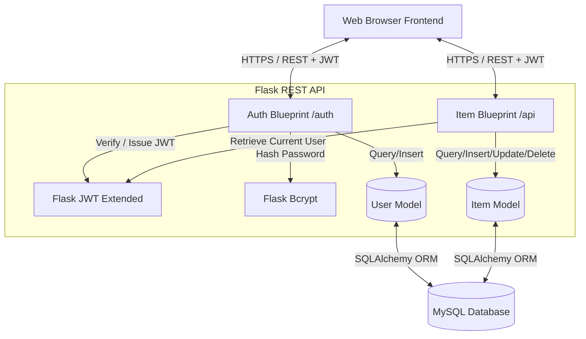

# 🛡️ DataVault

DataVault is a high-performance, secure, and visually stunning web platform designed for managing personal data vaults, credentials, and sensitive items. Featuring a premium **Cyberpunk-inspired Dark Glassmorphism** user interface, it provides seamless data management with state-of-the-art security practices.

The platform is powered by a robust **Flask** backend with **JWT-protected REST APIs**, **SQLAlchemy ORM**, and a secure **MySQL** database.

---

## 🚀 Key Features

*   **Stateless JWT Authentication:** Secure login and registration powered by `Flask-JWT-Extended`. Access tokens are securely managed and transmitted via authorization headers to protect REST endpoints.
*   **Robust Data Security:** Industry-standard password hashing using `Flask-Bcrypt` (bcrypt algorithm) ensuring cryptographic resistance against brute force.
*   **Full CRUD Operations:** Seamless creation, reading, updating, and deletion of vault items mapped directly to authenticated users.
*   **Advanced Filtering & Search:** Real-time query search and category-based filtering on the database level for lightning-fast responsiveness.
*   **High-End Cyberpunk UI:** A responsive, aesthetic dashboard featuring fluid micro-interactions, vivid glowing gradients, high-performance styling, and fully animated UI transitions.
*   **Database Migrations & Seeders:** Included scripts to easily migrate columns, reset tables, and seed premium mock cyberpunk test data.

---

## 🛠️ Tech Stack

### Backend
*   **Language:** Python 3.10+
*   **Framework:** Flask (Modularized with Blueprints)
*   **ORM:** SQLAlchemy / Flask-SQLAlchemy
*   **Authentication:** Flask-JWT-Extended (JSON Web Tokens)
*   **Security:** Flask-Bcrypt
*   **Driver:** PyMySQL (MySQL interface)

### Frontend
*   **Core:** Modern Vanilla JavaScript (ES6+), HTML5 Semantic markup
*   **Styling:** CSS3 Custom Properties (Aesthetic glassmorphism, flexbox/grid layout, premium CSS transitions)

### Database
*   **Engine:** MySQL 8.x

---

## 📂 Project Architecture

```
DataVault/
├── src/
│   ├── app.py             # Application entry point, Blueprint registrations & static serving
│   ├── config.py          # Configuration loader using environment variables
│   ├── extensions.py      # Flask extension initializations (DB, Bcrypt, JWT)
│   ├── models/            # SQLAlchemy Database Models
│   │   ├── __init__.py
│   │   ├── user.py        # User Schema & Password Hashing mapping
│   │   └── item.py        # Item Schema (Linked via Foreign Key to User)
│   └── routes/            # Blueprint Route Handlers
│       ├── __init__.py
│       ├── auth.py        # Authentication APIs (Register, Login, Me)
│       └── item.py        # Core CRUD APIs (Items, Categories)
├── frontend/              # High-End Dark UI static files
│   ├── index.html         # Portal registration / login interface
│   ├── dashboard.html     # Vault management CRUD panel
│   ├── app.js             # Auth handling & API communications
│   └── style.css          # Core design tokens, neon gradients & layouts
├── migrate.py             # Automatic table column migration script
├── reset_db.py            # Hard reset & premium data seeder
├── requirements.txt       # Project dependencies
└── .env                   # Environment secrets configuration
```

---

## 📊 System Architecture



---

## ⚙️ Setup & Installation

### 1. Prerequisites
Ensure you have the following installed on your local environment:
*   [Python 3.10+](https://www.python.org/downloads/)
*   [MySQL Server](https://dev.mysql.com/downloads/installer/)

### 2. Clone & Navigate
```bash
git clone <repository-url>
cd DataVault
```

### 3. Virtual Environment Setup
Create a virtual environment and install the required Python packages:
```powershell
# Create environment
python -m venv venv

# Activate on Windows
.\venv\Scripts\activate

# Install dependencies
pip install -r requirements.txt
```

### 4. Environment Configuration
Create a `.env` file in the root directory (or update the existing one) with your credentials:
```env
SECRET_KEY=your-super-secret-key-change-in-production
JWT_SECRET_KEY=your-jwt-secret-key-change-in-production
DATABASE_URL=mysql+pymysql://<db_username>:<db_password>@localhost/<db_name>
```
*Replace `<db_username>`, `<db_password>`, and `<db_name>` with your MySQL credentials.*

### 5. Initialize the Database
Ensure your MySQL server is running and the database specified in `DATABASE_URL` has been created. Then, run the database reset and seeding script to prepare the environment with cybernetic mock data:
```bash
python reset_db.py
```
*Note: This creates a default test user with credentials `username: testuser` and `password: test1234`.*

### 6. Start the Server
Start the Flask development server:
```bash
python src/app.py
```
The application will launch and be accessible at **[http://localhost:5000](http://localhost:5000)**!

---

## 🔑 REST API Reference

All requests must supply the JSON content header: `Content-Type: application/json`.
Paths prefixed with `/api` require a valid bearer token passed in the Authorization header: `Authorization: Bearer <your_jwt_token>`.

### Authentication Endpoints (`/auth`)

| Endpoint | Method | Authentication | Description |
| :--- | :--- | :--- | :--- |
| `/auth/register` | `POST` | None | Create a new user account. Returns access token. |
| `/auth/login` | `POST` | None | Authenticate credentials. Returns access token. |
| `/auth/me` | `GET` | **JWT Required** | Retrieve current logged-in user profile details. |

### Vault Item Endpoints (`/api`)

| Endpoint | Method | Authentication | Description |
| :--- | :--- | :--- | :--- |
| `/api/items` | `GET` | **JWT Required** | Retrieve all items for the user. Supports query parameters `q` (search) and `category` (filter). |
| `/api/items` | `POST` | **JWT Required** | Create a new vault item. Required payload: `name`. Optional: `description`, `category`. |
| `/api/items/<id>` | `GET` | **JWT Required** | Retrieve detailed view of a specific item. |
| `/api/items/<id>` | `PUT` | **JWT Required** | Update attributes (`name`, `description`, `category`) of an item. |
| `/api/items/<id>` | `DELETE`| **JWT Required** | Permanently delete an item from the vault. |
| `/api/categories` | `GET` | **JWT Required** | Fetch all unique categories created by the user. |
| `/api/health` | `GET` | None | Verify backend server health. |

---

## 🔒 Security Implementations

*   **Password Cryptography:** Transparent, standard password hashing using Bcrypt salt generation on user creation and verification on authentication.
*   **JWT Integrity & Protection:** Signed stateless tokens that hold user identities encrypted with HS256. Prevents cross-session tampering and enables high scalable load balancing.
*   **Context Verification:** Standard database queries ensure users can only see, modify, or delete items where `user_id` matches the token-supplied identity, preventing unauthorized ID-harvesting or resource hijacking.
